# 💊STM32 기반 스마트 알약 자동 디스펜서 (Pill-O-Clock)

본 프로젝트는 대한상공회의소 서울기술교육센터 AI 융합 로봇 SW 개발자 2기 과정 중 CORTEX-M4 기반 임베디드 시스템 제어 수업의 프로젝트로 진행되었다.

STM32F411xE MCU가 탑재된 Nucleo-64 보드를 기반으로 하며, 레지스터 직접 제어로 스탭모터, dc모터, 서보모터, LCD 스크린, 블루투스모듈, 초음파, led 제어를 하는 통합 시스템이다. 모든 하드웨어 자원을 통합적으로 응용하기 위해 '스마트 알약 자동 디스펜서'를 최종 주제로 선정하였다.


---

## 📌 프로젝트 개요

| 항목 | 내용 |
|------|------|
| **프로젝트명** | STM32 기반 스마트 알약 자동 디스펜서 |
| **개발 기간** | 2026.04.03 ~ 2026.04.13 (7일) |
| **개발 인원** | 4명 |
| **MCU** | STM32F411RE (ARM Cortex-M4, 100MHz) |
| **보드** | STM32 Nucleo-64 |
| **개발 방식** | HAL 라이브러리 미사용 · 모든 주변장치 레지스터 직접 접근 및 제어 |
| **주요 목표** | 복약 관리의 어려움을 겪는 사용자를 위한 자동화 솔루션 구현 |
| **결과** | 시간 및 요일별 자동 약 배출 시스템 완성 및 정상 작동 확인 |


---

### 배경 및 목적

복약 관리의 어려움을 겪는 고령자·만성질환자를 위해, 스마트폰 앱으로 손쉽게 복약 시간을 설정하고 자동으로 약을 배출해주는 IoT 기반 스마트 디스펜서를 개발하였다.

- **복약 관리 자동화** : 설정된 시간에 자동으로 약이 배출되어 복약 누락 방지
- **블루투스 앱 연동** : 편리한 복약 시간 설정 및 원격 제어 기능
- **요일별 약 관리** : 7개 약통으로 요일별 약 자동 배출 및 보충
- **사용자 알림 기능** : 부저 알림 및 복약 확인 기능으로 사용자 편의성 향상
- **친근한 디자인** : 인터랙티브 펫 컨셉의 외형 디자인 적용

---
## 📋 주요 기능

### 1. 자동 약 배출 시스템
- STM32 내부 타이머를 통한 정확한 시간 추적
- 설정된 복약 시간 도달 시 자동으로 배출 프로세스 시작
- 스텝 모터가 해당 요일 약통을 배출구로 정밀 이동 **(51.4°/일)**
- 서보 모터 PWM 제어로 배출구 개폐 **(0° ~ 45°)**

> **스텝 모터 계산식**  
> `32 steps × 기어비(64) × 약통 기어비(7.8) ÷ 7일 = 2,282 steps/일`

### 2. 알약 자동 보충 시스템
- 상부 알약 저장 공간에 모듈 형식으로 약통 장착 가능
- 스텝 모터가 정밀한 각도로 회전하여 한 칸씩 순차적으로 알약 적재
- 앱에서 요일 선택 시 해당 칸에 자동 보충

### 3. 블루투스 통신 및 앱 제어
- **HC-05 블루투스 모듈** 기반 STM32 ↔ 앱 양방향 UART 시리얼 통신
- 통신 속도: **9600bps** 안정적 데이터 전송
- 앱에서 전송된 복약 시간·요일 데이터를 STM32에 저장
- 설정 확인 및 시스템 상태 피드백 전송

| 앱 구성 모듈 | 기능 |
|---|---|
| 블루투스 연결부 | 장치 검색 및 HC-05 연결 |
| 시간/알람 설정부 | 현재 시간 표시 및 알람 비교 |
| 자동 채우기 전송부 | 요일 및 시간 데이터 문자열 송신 |
| 응답 수신부 | STM32 응답을 읽어 상태 표시 |

### 4. 센서 기반 이송 제어
- **초음파 센서**로 컨베이어 벨트 위 약의 위치를 실시간 측정
- 설정 거리 도달 시 DC 모터 자동 정지 → 약 분실 방지
- PSC·ARR 값 조정으로 모터 적정 속도 설정

### 5. 사용자 인터페이스
- **부저** : 복약 시간 알림 출력
- **버튼** : 복약 확인 입력 및 부저 정지
- **LCD** : 현재/다음 복약 시간 및 현재 동작 상태 실시간 표시
- **LED** : 시스템 동작 상태 표시


---

## 🛠 기술 스택

### Hardware
| 구분 | 부품 |
|------|------|
| MCU | STM32 (ARM Cortex-M) |
| 블루투스 | HC-05 모듈 (UART, 9600bps) |
| 액추에이터 | 스텝 모터 × 2, 서보 모터 × 1, DC 모터 × 1 |
| 센서 | 초음파 센서 (거리 측정) |
| 입력 | 푸시 버튼 |
| 출력 | LCD, LED, 부저 |
| 전원 | 외부 전원 모듈 (다중 모터 전류 대응) |
| 케이스 | 3D 프린트 (FDM, 인터랙티브 펫 디자인) |

### Software / Firmware
| 구분 | 내용 |
|------|------|
| Firmware | STM32 HAL / LL 드라이버 (C언어) |
| 타이머 제어 | STM32 내부 RTC + TIM (PWM, 인터럽트) |
| 인터럽트 관리 | NVIC 우선순위 설정 (타이머 > 버튼 > UART) |
| 앱 개발 | MIT App Inventor (Android) |
| 3D 모델링 | Fusion 360 (3D 프린트용) |


---

##  📷  실물 사진


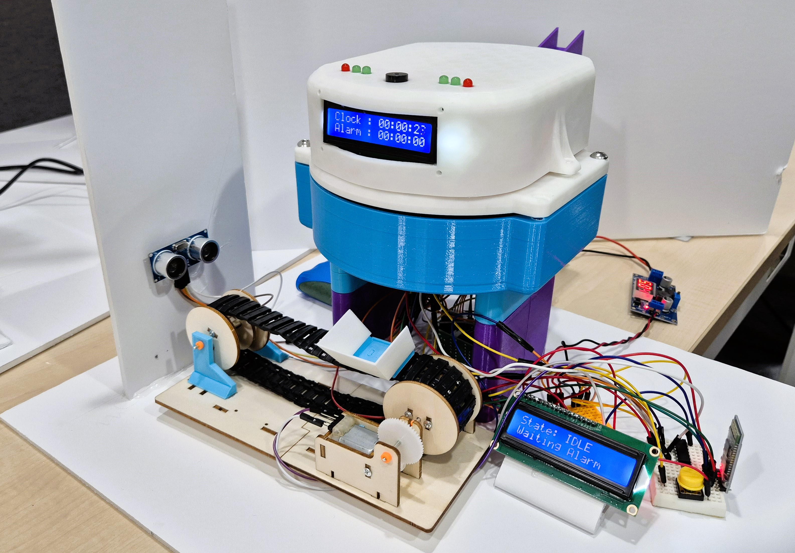

### 기구 설계
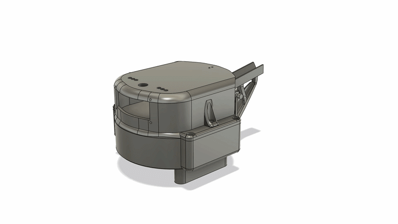 
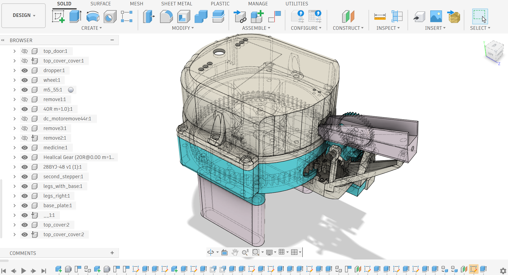 

#### 스텝 모터 및 서보 모터 제어
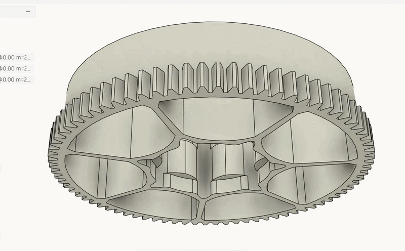 

- 스텝모터: 요일별 약통 위치 제어(51.4°/일)
- 서보모터: PWM으로 배출 타이밍 및 0°-45° 제어
- STM32 내부 타이머를 통한 정확한 시간 추적, 설정된 시간 도달 시 자동으로 배출 프로세스 시작

#### 스텝모터를 이용한 알약 공급 메커니즘

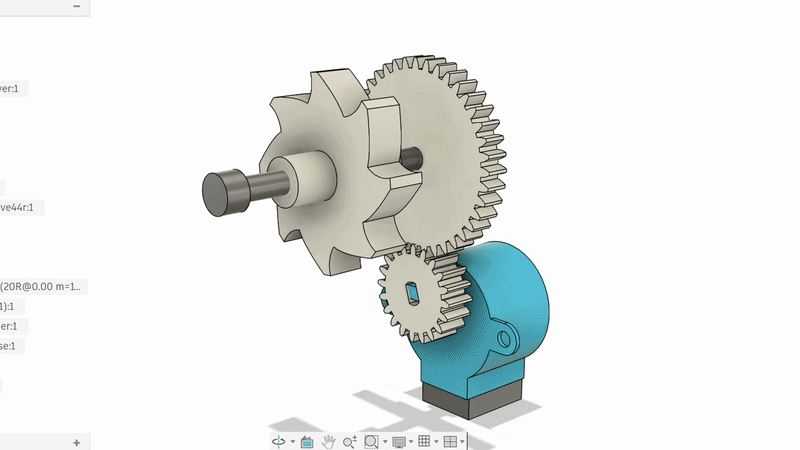 

- 스텝모터가 정밀한 각도로 회전 제어 및 한 칸씩 순차적으로 알약 적재

#### 앱
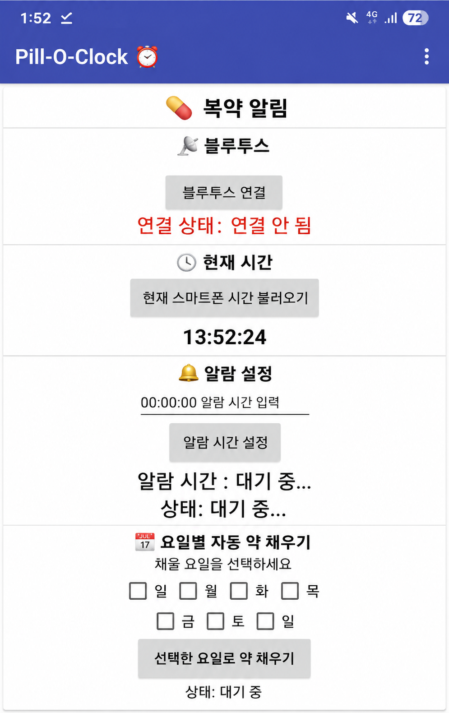 

---

## 🎥 시연 영상

### [원본 동영상 (Youtube)](https://youtu.be/ekS_dpz__AQ)

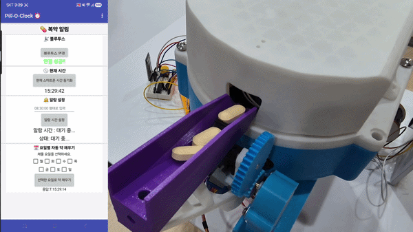 
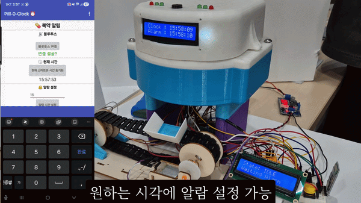 


---


## 📅 개발 일정

| 일차 | 내용 |
|------|------|
| 1일차 | 시스템 설계 (회로도, 기구 설계, 개발 계획 수립) |
| 2일차 | 앱 연동 (App Inventor ↔ HC-05 블루투스 통신 구현) |
| 3일차 | 제어 설계 (모터 제어 로직, RTC 알람, 인터럽트 처리) |
| 4일차 | 시스템 통합 (센서·모터·UI 통합, 전원 안정화) |
| 5일차 | 3D 프린트 완료 및 조립 |
| 6일차 | 최종 조립 및 기능 테스트 |
| 7일차 | 시스템 검증 및 PPT 제작 |


---

## 🏗 시스템 아키텍처

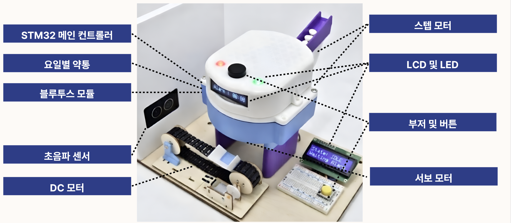


#### 하드웨어 플로우차트

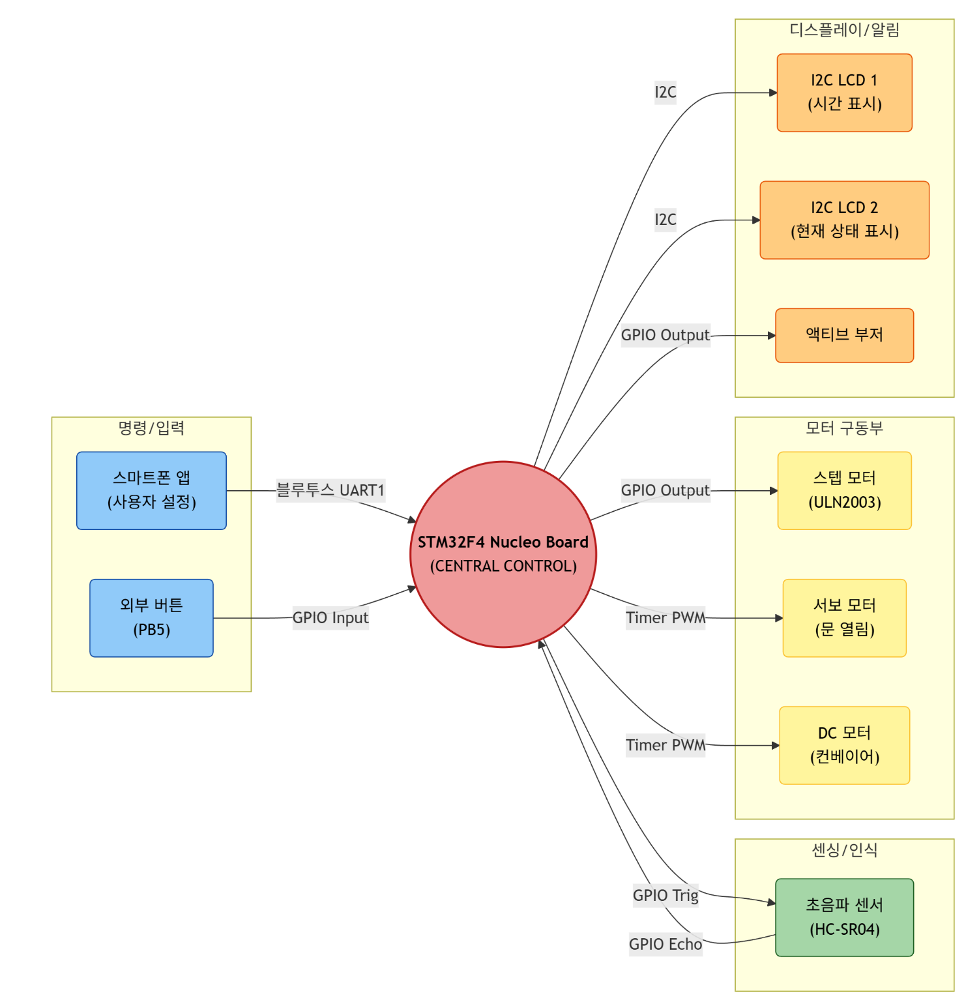

#### 소프트웨어 플로우 차트

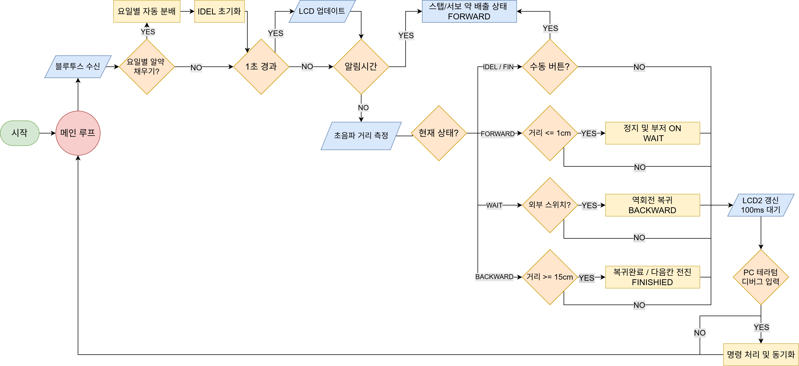 

```
[앱 인벤터 앱]
      │ 블루투스 (HC-05)
      ▼
[STM32 MCU]
  ├── 내부 RTC 타이머 → 알람 판단
  ├── 스텝 모터 A → 요일별 약통 위치 제어 (51.4°/일)
  ├── 스텝 모터 B → 상부 알약 자동 보충 메커니즘
  ├── 서보 모터   → 배출구 개폐 (0° - 45°)
  ├── DC 모터     → 컨베이어 벨트 구동 (약 이송)
  ├── 초음파 센서 → 약 위치 실시간 측정 → 벨트 정지 제어
  ├── 부저        → 복약 시간 알림
  ├── 버튼        → 복약 확인 입력
  └── LCD         → 현재/다음 복약 시간 및 동작 상태 표시
```

---

## 🔌 회로도

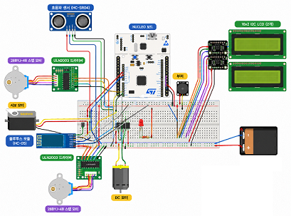 

<br>

<br>

<details>
  <summary><b>핀맵</b></summary>

| 모듈 | STM32 핀 | 모듈 측 연결 | 전원 연결 | 비고 |
| :--- | :--- | :--- | :--- | :--- |
| 부저 | **PB6** | 부저 신호선 → PB6 | 별도 전원 없음 | TIM4_CH1 PWM 출력 |
| 외부 스위치 | **PB5** | 스위치 한쪽 → PB5, 다른쪽 → GND | 별도 전원 없음 | 내부 Pull-up 사용, 눌렀을 때 active-low |
| 블루투스 모듈 | **PA9**, **PA10** | 모듈 TXD → PA10, 모듈 RXD → PA9 | VCC, GND 연결 | USART1 사용 |
| PC 터미널 (UART2) | **PA2**, **PA3** | USB-UART TX ↔ PA3, RX ↔ PA2 | 보드 경유 | USART2 사용 |
| I2C LCD 1602 | **PB8**, **PB9** | SCL → PB8, SDA → PB9 | LCD VCC, GND | I2C1, 현재 코드상 1개 LCD |
| 초음파 센서 HC-SR04 | **PC4**, **PC5** | Trig → PC4, Echo → PC5 | 5V, GND | Echo 5V 레벨 주의 필요 |
| DC 모터 드라이버 입력 | **PA0**, **PA1** | IN1/PWM → PA0, IN2/PWM → PA1 | 드라이버 VM, GND 별도 | TIM5 PWM |
| 서보모터 (SG90) | **PA6** | Signal → PA6 | 5V, GND | TIM3 CH1 |
| 스텝모터 (28BYJ-48) 드라이버 1 | **PC0**, **PC1**, **PC2**, **PC3** | IN1~IN4 → PC0~PC3 | 드라이버 전원 별도 | 기존 약통 회전 |
| 스텝모터 (28BYJ-48) 드라이버 2 | **PC6**, **PC7**, **PC8**, **PC9** | IN1~IN4 → PC6~PC9 | 드라이버 전원 별도 | 약 보충/배출용 |
| 상태 LED 빨강 2개 | **PB12** | 각 LED 입력 | 적절한 저항 필요 | 약 배출 시 ON |
| 상태 LED 초록 4개 | **PA7** | 각 LED 입력 | 적절한 저항 필요 | 역회전 복귀 시 ON |
| 보드 LED | **PA5** | 추가 결선 없음 | 보드 내장 | 기본 LED |
| RTC (LSE) | **PC14**, **PC15** | 연결 금지 | LSE용 | RTC 때문에 점유 |~

</details>

<details>
  <summary><b>타이머 설정</b></summary>

| 타이머 | 비고 |
| :--- | :--- |
| TIM2 | 정밀 대기 (스텝/서보 간격)|
| TIM3 |	서보 모터 PWM (PA6) |
| TIM4 |	부저 PWM (PB6) |
| TIM5 |	DC 모터 PWM (PA0, PA1) |

</details>


---


## 🔥 문제 해결 과정 (Trouble Shooting)


### Case 1. 하드웨어 — DC 모터 토크 부족 & 전원 공급 불안정

**🔴 문제 상황**
- DC 모터 토크 부족으로 알약 이송 시 동작 실패
- 타이머 설정 변경 후 이동 속도가 과도하게 빨라짐
- 스텝 모터·서보 모터·DC 모터 3개 동시 구동 시 순간 전류로 인한 전압 강하 발생
- 전압 강하로 MCU 리셋 현상 반복

**🟡 원인 분석**
- 단일 전원으로 다수의 구동계 부품에 전류 공급 → 피크 전류 초과
- PWM 타이머의 PSC·ARR 기본값이 해당 모터에 부적합

**🟢 해결 방법**
- **외부 전원 모듈 추가** : MCU 안정 동작을 위한 전원 분리 및 보강
- **PSC·ARR 값 튜닝** : 다양한 값을 비교 테스트하여 적정 속도 확보
- **결과** : 알약 배출·컨베이어 벨트 동작 안정화, 연속 동작 안정성 검증 완료

---

### Case 2. 소프트웨어 — RTC 오차 & 인터럽트 우선순위 충돌

**🔴 문제 상황**
- RTC 오차로 인해 알림 시간이 실제 시간과 불일치 발생
- 버튼 입력·알람 처리·UART 인터럽트 간 우선순위 충돌로 응답 지연 발생
- 사용자 신뢰성 저하 문제 발생

**🟡 원인 분석**
- RTC 클럭 소스의 오차 누적
- NVIC 인터럽트 우선순위 미설정으로 ISR 간 충돌

**🟢 해결 방법**
- **RTC 캘리브레이션** : 오차 측정 후 보정값 적용
- **NVIC 우선순위 재설정** : `타이머 > 버튼 > UART` 순으로 우선순위 정리
- **크리티컬 섹션 보호 코드** 추가로 ISR 충돌 방지
- **결과** : 알림 시간 정확도 향상, 시간 오차 대폭 감소, 버튼 입력 및 알람 동작 안정화

<br>

---

## 🚀 향후 개선 방향

| 분류 | 내용 |
|------|------|
| 센서 개선 | 잔량 감지 센서 추가 → 약 소진 전 사전 알림 기능 |
| 통신 고도화 | Wi-Fi 모듈 연동 기반 원격 모니터링 및 클라우드 연동 |
| 보호자 기능 | 보호자 앱 연동 및 복약 이력 확인 기능 |
| 완성도 | 3D 프린트 필라멘트 색상 통일로 외관 품질 향상 |

<br>

---

## 👥맡은 역할
LCD제어, +++


<br>

<table>
  <tr>
    <td align="center">
      <a href="https://github.com/gammapasta">
        
        <br />
        <sub><b>gammaspasta</b></sub>
      </a>
      <br />
      최준호
    </td>
    <td align="center">
      <a href="https://github.com/SJ00-03">
        
        <br />
        <sub><b>Seongjun Yang</b></sub>
      </a>
      <br />
      양성준
    </td>
        <td align="center">
      <a href="https://github.com/Kor-JasonKim">
        
        <br />
        <sub><b>Kor-JasonKim</b></sub>
      </a>
      <br />
      김건
    </td>
        <td align="center">
      <a href="https://github.com/hslee0722">
        
        <br />
        <sub><b>hslee0722</b></sub>
      </a>
      <br />
      이한성
    </td>
  </tr>
</table>

---


<p align="center">
  <b>STM32 기반 스마트 알약 자동 디스펜서</b><br>
  블루투스 연동 · 자동 배출 · 시간·요일 기반 제어 · 센서 통합 · 친근한 디자인
</p>
