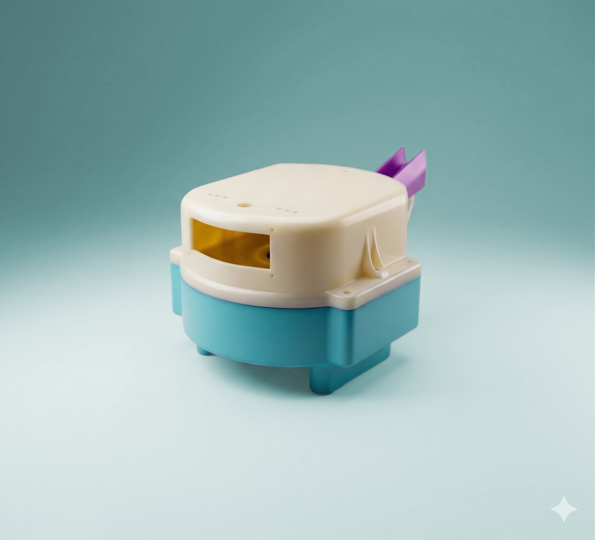
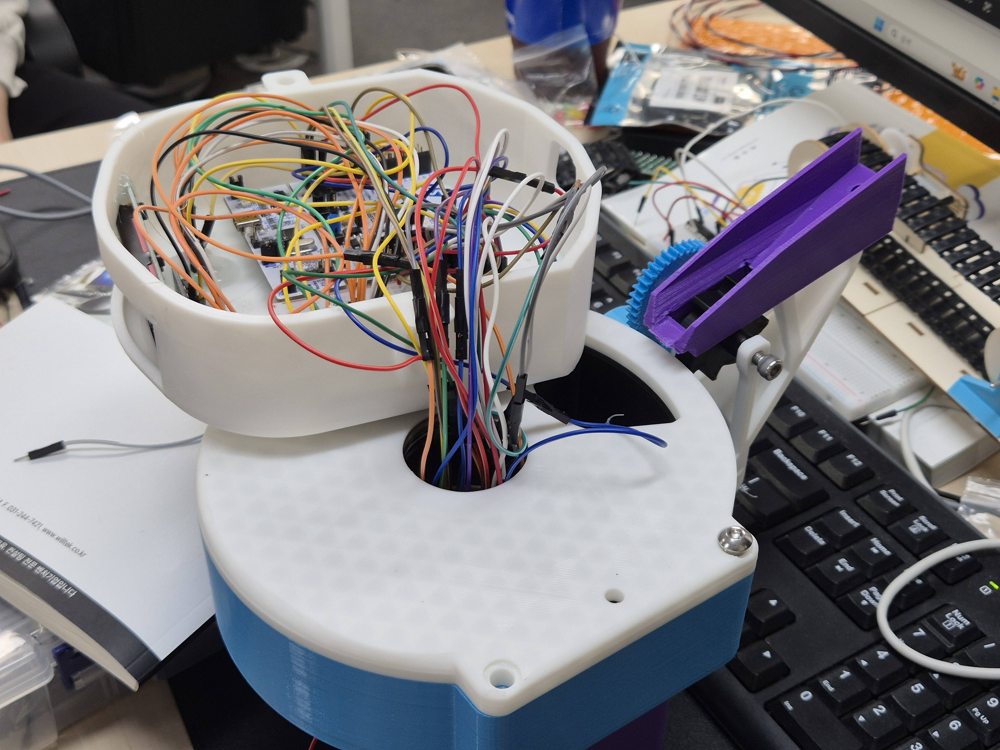
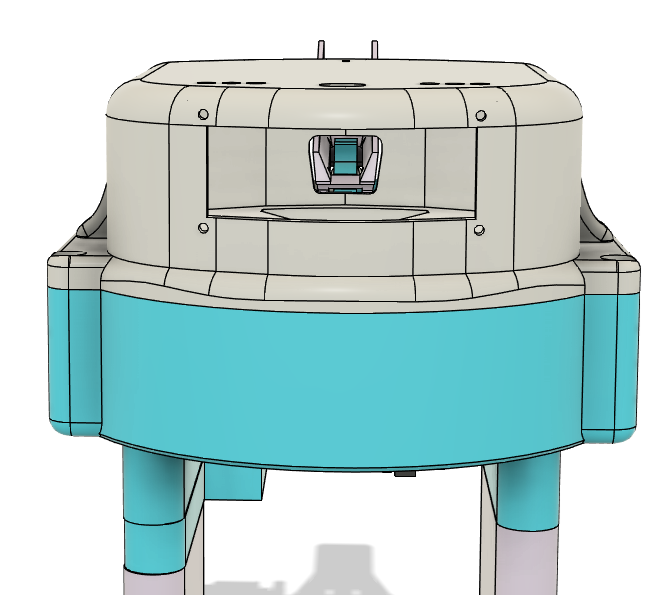

# 💊 Pill-O-Clock — STM32 스마트 알약 자동 디스펜서

<p align="center">
  
</p>

<p align="center">
  <b>팀 프로젝트 기반 / 포트폴리오용 리팩토링 및 문서화</b><br />
  STM32F411RE · 레지스터 직접 제어 · Bluetooth 앱 연동 · 요일/시간 기반 자동 약 배출
</p>

---

## 1. 프로젝트 소개

**Pill-O-Clock**은 복약 시간을 놓치기 쉬운 사용자를 위해 정해진 시간과 요일에 맞춰 알약을 배출하는 STM32 기반 임베디드 시스템 프로젝트입니다.

이 저장소는 팀원이 만든 기반 프로젝트를 가져와, 포트폴리오에서 읽기 쉽도록 **README 구조, 설명 흐름, 이미지 배치, 구현 범위 구분**을 정리한 버전입니다. 기능 로직은 유지하는 것을 우선했고, 이번 정리 작업에서는 펌웨어 동작 코드를 변경하지 않았습니다.

| 항목 | 내용 |
| --- | --- |
| 프로젝트 유형 | 팀 프로젝트 기반 포트폴리오 정리 |
| 개발 기간 | 2026.04.03 ~ 2026.04.13 |
| 개발 인원 | 4명 |
| 보드 / MCU | STM32 Nucleo-64 / STM32F411RE, ARM Cortex-M4 |
| 핵심 구현 | RTC 알람, 모터 제어, 블루투스 UART, LCD/LED/부저 UI, 초음파 센서 기반 이송 제어 |
| 개발 방식 | STM32 레지스터 직접 접근 중심, CMSIS 헤더 기반 C 펌웨어 |
| 포트폴리오 정리 범위 | 문서 구조화, 이미지/섹션 재배치, 원본 기능과 정리 기여 구분 |

---

## 2. 주요 기능

### 2.1 시간 기반 자동 약 배출

- STM32 RTC로 현재 시간을 추적하고 알람 시간을 비교합니다.
- 알람 발생 시 요일별 약통을 회전시키고 서보 모터로 배출구를 열고 닫습니다.
- 배출 이후 컨베이어 벨트를 구동해 약을 사용자가 가져가기 쉬운 위치로 이동시킵니다.

```text
RTC Alarm
   ↓
약통 회전 Stepper Motor
   ↓
배출구 Servo Open / Close
   ↓
DC Motor Conveyor
   ↓
초음파 거리 확인 후 정지
```

### 2.2 요일별 약통 회전 및 자동 보충

- 7일 치 약통을 기준으로 스텝 모터가 정해진 각도만큼 회전합니다.
- 앱에서 선택한 요일 데이터에 따라 특정 슬롯에 약을 보충하는 시퀀스를 실행합니다.
- README 기준 계산식은 다음과 같습니다.

```text
32 steps × 기어비 64 × 약통 기어비 7.8 ÷ 7일 ≒ 2,282 steps/day
```

### 2.3 Bluetooth 앱 연동

- HC-05 Bluetooth 모듈을 통해 Android 앱과 UART 통신합니다.
- 앱은 요일/시간 데이터를 전송하고, STM32는 수신 문자열을 바탕으로 알람 또는 자동 보충 동작을 처리합니다.
- 코드 기준 UART 구성은 PC 디버깅용 UART2 115200bps, Bluetooth용 UART1 9600bps로 분리되어 있습니다.

### 2.4 사용자 피드백 UI

- LCD: 현재 시간, 알람 시간, 동작 상태 표시
- LED: 배출/복귀 등 상태 표시
- Buzzer: 복약 알림 출력
- Button: 복약 확인 및 알림 정지 입력

---

## 3. 기술 스택

### Hardware

| 분류 | 사용 부품 / 역할 |
| --- | --- |
| MCU | STM32F411RE, ARM Cortex-M4 |
| Board | STM32 Nucleo-64 |
| Communication | HC-05 Bluetooth, UART |
| Actuator | Stepper Motor × 2, Servo Motor × 1, DC Motor × 1 |
| Sensor | HC-SR04 초음파 센서 |
| UI | I2C LCD, 상태 LED, Buzzer, Button |
| Mechanical | 3D 프린트 케이스, 요일별 약통 회전 구조 |

### Firmware / Tooling

| 분류 | 내용 |
| --- | --- |
| Language | C, Assembly startup |
| MCU 제어 | CMSIS/STM32 헤더 기반 레지스터 직접 제어 |
| Build | Makefile, arm-none-eabi-gcc toolchain |
| 주요 모듈 | RTC, Timer/PWM, UART, LCD, Motor, Ultrasonic, Buzzer, LED |
| App | MIT App Inventor 기반 Android 앱 |
| Modeling | Fusion 360 기반 3D 모델링 |

---

## 4. 시스템 구조

<p align="center">
  
</p>

```text
[Android App / MIT App Inventor]
          │
          │ Bluetooth UART, HC-05
          ▼
[STM32F411RE]
  ├─ RTC / Alarm        : 시간 및 알람 판단
  ├─ Stepper Motor #1   : 요일별 약통 위치 제어
  ├─ Stepper Motor #2   : 알약 보충/공급 메커니즘
  ├─ Servo Motor        : 배출구 개폐
  ├─ DC Motor           : 컨베이어 이송
  ├─ Ultrasonic Sensor  : 약 위치 거리 측정
  ├─ LCD / LED          : 상태 표시
  ├─ Buzzer             : 복약 알림
  └─ Button             : 사용자 확인 입력
```

### 하드웨어 흐름

<p align="center">
  
</p>

### 소프트웨어 흐름

<p align="center">
  
</p>

---

## 5. 화면 및 시연 자료

### 실물 및 기구 설계

<p align="center">
  
  
</p>

<p align="center">
  
  
</p>

### 동작 GIF

<p align="center">
  
  
</p>

<p align="center">
  
  
</p>

### Android 앱 화면

<p align="center">
  
</p>

- 원본 시연 영상: [YouTube](https://youtu.be/ekS_dpz__AQ)

---

## 6. 회로 및 핀맵

<p align="center">
  
</p>

<details>
<summary><b>핀맵 보기</b></summary>

| 모듈 | STM32 핀 | 연결 / 역할 | 비고 |
| --- | --- | --- | --- |
| Buzzer | PB6 | TIM4_CH1 PWM | 복약 알림 |
| Button | PB5 | Pull-up 입력 | 복약 확인 / 알림 정지 |
| Bluetooth HC-05 | PA9, PA10 | USART1 TX/RX | 앱 연동, 9600bps |
| PC Debug UART | PA2, PA3 | USART2 TX/RX | 터미널 디버깅, 115200bps |
| I2C LCD | PB8, PB9 | I2C1 SCL/SDA | 상태 표시 |
| Ultrasonic HC-SR04 | PC4, PC5 | Trig / Echo | Echo 5V 레벨 주의 |
| DC Motor Driver | PA0, PA1 | TIM5 PWM | 컨베이어 구동 |
| Servo Motor | PA6 | TIM3 CH1 | 배출구 개폐 |
| Stepper Motor #1 | PC0~PC3 | IN1~IN4 | 요일별 약통 회전 |
| Stepper Motor #2 | PC6~PC9 | IN1~IN4 | 약 보충/공급 |
| Status LED Red | PB12 | 상태 출력 | 배출 상태 |
| Status LED Green | PA7 | 상태 출력 | 복귀 상태 |
| Board LED | PA5 | Nucleo 내장 LED | 기본 상태 표시 |

</details>

<details>
<summary><b>타이머 사용</b></summary>

| 타이머 | 역할 |
| --- | --- |
| TIM2 | 정밀 지연 및 일부 모터 제어 타이밍 |
| TIM3 | Servo PWM |
| TIM4 | Buzzer PWM |
| TIM5 | DC Motor PWM |

</details>

---

## 7. 실행 방법

### 7.1 준비물

- STM32 Nucleo-64, STM32F411RE 기반 보드
- arm-none-eabi-gcc toolchain
- Make 또는 Windows MinGW/MSYS 환경
- STM32CubeProgrammer CLI
- HC-05, 모터 드라이버, LCD, 센서 등 핀맵에 맞춘 하드웨어 결선

### 7.2 빌드

현재 `src/Makefile`은 Windows 경로의 ARM GCC toolchain을 기준으로 작성되어 있습니다.

```makefile
TOOL_DIR = C:\arm-gnu-toolchain-15.2.rel1-mingw-w64-i686-arm-none-eabi
```

Windows에서 toolchain 설치 경로가 같다면 다음 명령으로 빌드합니다.

```bash
cd src
make clean
make
```

Linux/macOS 또는 다른 설치 경로를 사용하는 경우 `src/Makefile`의 `TOOL_DIR`, `TARGET`, 라이브러리 경로를 로컬 환경에 맞게 수정해야 합니다.

### 7.3 펌웨어 업로드

STM32CubeProgrammer CLI가 설치되어 있고 보드가 SWD로 연결되어 있다면 다음 명령을 사용할 수 있습니다.

```bash
cd src
make flash
```

---

## 8. 트러블슈팅

### Case 1. 모터 토크 부족 및 전원 불안정

| 구분 | 내용 |
| --- | --- |
| 문제 | 스텝 모터, 서보 모터, DC 모터 동시 구동 시 전압 강하 및 MCU 리셋 발생 |
| 원인 | 단일 전원에서 순간 피크 전류를 감당하기 어려움 |
| 대응 | 외부 전원 모듈을 추가하고 모터 구동부 전원을 분리 |
| 결과 | 알약 배출 및 컨베이어 이송 동작 안정화 |

### Case 2. 모터 속도 튜닝

| 구분 | 내용 |
| --- | --- |
| 문제 | PWM/타이머 설정에 따라 컨베이어 이동 속도가 과도하게 빨라지거나 토크가 부족함 |
| 원인 | PSC/ARR 설정이 실제 하드웨어 부하와 맞지 않음 |
| 대응 | 여러 PSC/ARR 조합을 비교해 적정 속도와 토크를 찾음 |
| 결과 | 알약 이송 중 이탈 가능성을 줄이고 안정적으로 정지하도록 개선 |

### Case 3. 인터럽트 우선순위 충돌

| 구분 | 내용 |
| --- | --- |
| 문제 | 알람, 버튼, UART 처리 시점이 겹치며 응답 지연 발생 |
| 원인 | 여러 이벤트가 동시에 들어올 때 우선순위와 상태 전이가 복잡해짐 |
| 대응 | 타이머/알람, 버튼, UART 처리 흐름을 분리하고 상태 플래그 기반으로 제어 |
| 결과 | 알람 발생 이후 배출 시퀀스와 사용자 입력 처리가 더 예측 가능해짐 |

---

## 9. 원본 기능과 포트폴리오 정리 범위

### 팀 프로젝트 원본 기반 기능

- STM32F411RE 펌웨어 구조
- RTC 알람 기반 자동 배출 로직
- 스텝 모터, 서보 모터, DC 모터 제어
- HC-05 Bluetooth UART 통신
- LCD, LED, Buzzer, Button 기반 사용자 피드백
- 초음파 센서 기반 컨베이어 정지 제어
- 3D 프린트 기구 설계 및 실물 프로토타입
- Android 앱 연동 흐름

### 포트폴리오용 리팩토링 및 문서화 범위

- README를 포트폴리오 소개 흐름에 맞춰 재작성
- 프로젝트 소개, 주요 기능, 기술 스택, 시스템 구조, 실행 방법, 트러블슈팅, 향후 개선점 섹션 정리
- 이미지와 GIF를 기능 설명에 맞게 재배치
- 팀 프로젝트 기반임을 명시하고 원본 기능과 문서화 기여를 구분
- 구현되지 않은 기능을 추가로 주장하지 않도록 표현 조정

---

## 10. 향후 개선점

| 분류 | 개선 방향 |
| --- | --- |
| 센서 | 약 잔량 감지 센서 추가 및 약 소진 알림 |
| 통신 | Wi-Fi 모듈 또는 BLE 기반 원격 모니터링 확장 |
| 앱 | 보호자용 복약 이력 확인 화면 추가 |
| 펌웨어 | 상태 머신 구조 정리, UART 프로토콜 문서화, 빌드 환경 OS 독립화 |
| 하드웨어 | 전원부 안정화 회로 보강, 케이스 마감 품질 개선 |

---

## 11. 팀 구성

<table>
  <tr>
    <td align="center">
      <a href="https://github.com/gammapasta">
        
        <br />
        <sub><b>gammapasta</b></sub>
      </a>
      <br />최준호
    </td>
    <td align="center">
      <a href="https://github.com/SJ00-03">
        
        <br />
        <sub><b>Seongjun Yang</b></sub>
      </a>
      <br />양성준
    </td>
    <td align="center">
      <a href="https://github.com/Kor-JasonKim">
        
        <br />
        <sub><b>Kor-JasonKim</b></sub>
      </a>
      <br />김건
    </td>
    <td align="center">
      <a href="https://github.com/hslee0722">
        
        <br />
        <sub><b>hslee0722</b></sub>
      </a>
      <br />이한성
    </td>
  </tr>
</table>

---

<p align="center">
  <b>Pill-O-Clock</b><br />
  팀 프로젝트 기반의 STM32 자동 알약 디스펜서 포트폴리오 문서화 버전
</p>
